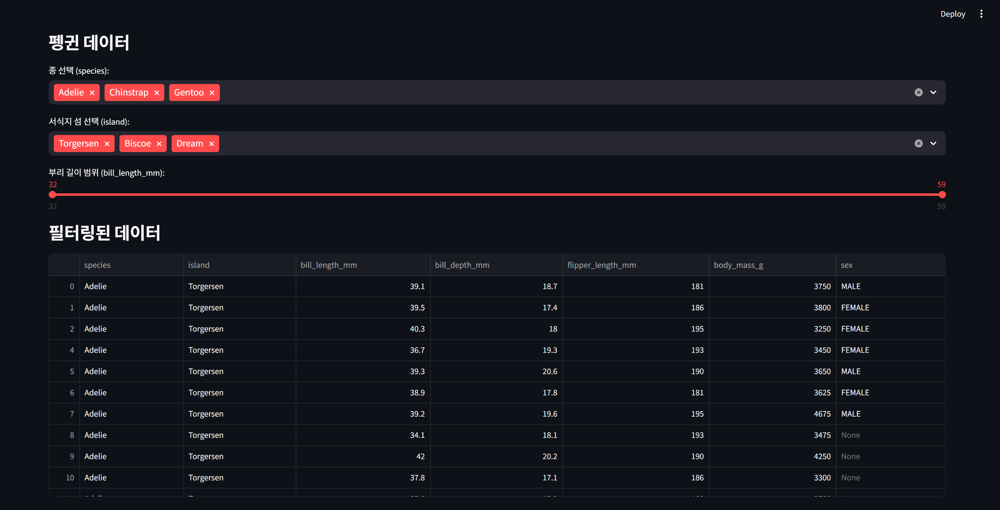

# Research-WebAppStreamlitCSV

> 2025년 2학기 오픈소스SW의이해[01] - Week11주차 Streamlit CSV Read 팀 프로젝트  
> **주제:** Streamlit 연습하기

## Preview

---

## 팀원 소개

| 이름 | 역할 | GitHub |
|------|------|---------|
| 김민준 | 팀장 | [minjunkim0205](https://github.com/minjunkim0205) |
| 안현서 | 팀원 | [han183536-ux](https://github.com/han183536-ux) |
| 김재욱 | 팀원 | [Gplexs](https://github.com/Gplexs) |
| 김민태 | 팀원 | [Assadgang](https://github.com/Assadgang) |

> 위 링크는 팀원 각자의 GitHub 프로필로 연결됩니다

---

## 환경 설정 (최초1회)

> Python 3.13.x 버전 이상 추천  
> .venv 가상환경 생성  
> pip install -r requirements.txt  

---

## 메모(무시 해도 됩니다)

> pip freeze > requirements.txt
